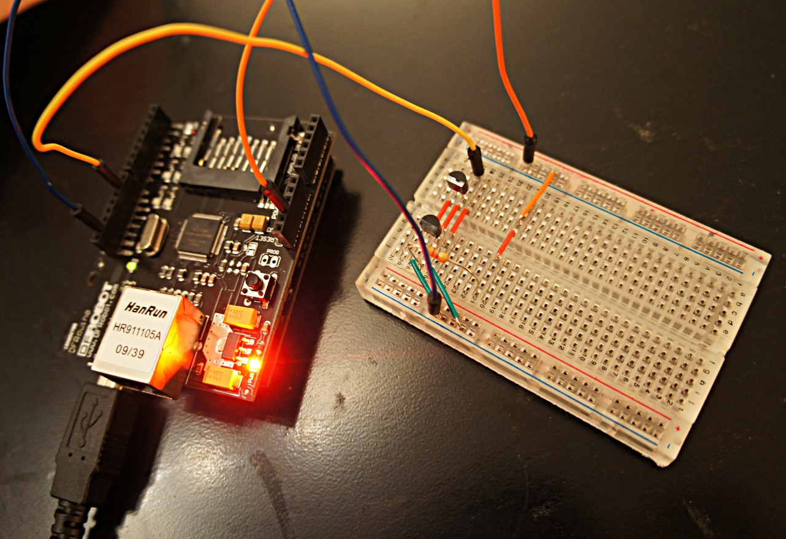

# BEERDUINO 

**BEERDUINO** is a small arduino project.

* The program is designed to run on Arduino Board + Ethernet Shield.
* Designed to read various Dallas DS18B20 sensors (on a 1wire bus).
* Reads multiple sensors temperatures.
* Embed a small web-server able to load simple HTML page and XML page with the temperature values.
* Can send a mail if temperature limits are reached.

Tested with Arduino 023 ( http://arduino.cc/ ) on a Duemilanove board.

Binary size < 16384 octets at this time.

## About the Java Program.

The JAVA program is intented to read to XML results published by the arduino board and to act according to the values read (for example, throwing a notification by mail, Notifry or PushTo).

## About the Java project.

* the sketchbook whole project is an Eclipse workspace (switch workspace to it), and the "java/" path is a Eclipse project ;
* needs Maven (external to Eclipse or embedded Maven 3 with Eclipse 3.7+) ;
* if Maven embedded, just right click project > Maven > Update dependencies ;
* configure "beerduino.cfg" as needed (arduino ip address, notifications, ...) ;
* run "src/main/java/Beerduino.java" (main entry point) ;

## About the C Arduino code

Use a few libraries (included in this github) :

* OneWire (v2) ( http://www.pjrc.com/teensy/td_libs_OneWire.html ) ;

* Webduino ( https://github.com/sirleech/Webduino ) ;

* Streaming ( http://arduiniana.org/2009/04/new-streaming-library/ ) ;

* DallasTemperature ( http://www.milesburton.com/?title=Dallas_Temperature_Control_Library ) ;

## The Arduino schema

<!--

-->

## Links.
* A good tutorial (for electric schema and various other information on 1wire) : http://www.mon-club-elec.fr/pmwiki_mon_club_elec/pmwiki.php?n=MAIN.ArduinoExpertCapteursComplexesDS18B20Detection
* Dallas DS18B20 specs : http://datasheets.maxim-ic.com/en/ds/DS18B20.pdf
* Arduino utorial about 1wire : http://www.arduino.cc/playground/Learning/OneWire
* Dallas sensors can be bought on ebay or here : http://www.domadoo.fr
* Fritzing editor for building Arduino schemas : http://fritzing.org/download/
* Another GITHub project with the same name and a related purpose : https://github.com/malcolmmp/Beerduino/blob/master/Beerduino.pde
* Yet another related project : http://www.uchobby.com/index.php/2007/10/08/arduino-beer-thermostat/

# What does the XML results published by the Arduino board look like ?

<!-- BEGIN_AUTOGENERATED_CONTENT_TEMPERATURES_RESULTS -->
## 1. Sensors

Temperature results. One entry for each sensor.

### Attributs

<table>
  <tr>
    <th><b>Attributs</b></th>
    <th><b>Type</b></th>
    <th><b>Req</b></th>
    <th><b>Description</b></th>
  </tr>
  <tr>
    <td>time</td>
    <td>String</td>
    <td> X </td>
    <td>Time the whole XML results file has been generated.</td>
  </tr>
</table>

### Elements

<table>
  <tr>
    <th><b>Elements</b></th>
    <th><b>Type</b></th>
    <th><b>Req</b></th>
    <th><b>Description</b></th>
  </tr>
  <tr>
    <td>Liste de <a href="#2._Sensor">sensor</a></td>
    <td><a href="#2._Sensor">sensor</a></td>
    <td> X </td>
    <td>Individual sensor temperature result</td>
  </tr>
</table>

### Exemple

<pre>
&lt;sensors time='...'&gt;
   &lt;!-- Liste de 'sensor' --&gt;
   &lt;sensor&gt;
   . . .
   &lt;/sensor&gt;
   .
   .
   .
   &lt;sensor&gt;
   . . .
   &lt;/sensor&gt;
&lt;/sensors&gt;
</pre>

### Implémentation

<table>
  <tr>
    <td>Package</td>
    <td>org.tensin.beerduino</td>
  </tr>
  <tr>
    <td>Classe</td>
    <td>TemperatureResults</td>
  </tr>
</table>

## 2. Sensor

Individual result for one sensor.

### Attributs

<table>
  <tr>
    <th><b>Attributs</b></th>
    <th><b>Type</b></th>
    <th><b>Req</b></th>
    <th><b>Description</b></th>
  </tr>
  <tr>
    <td>value</td>
    <td>double</td>
    <td> X </td>
    <td>The read temperature</td>
  </tr>
  <tr>
    <td>id</td>
    <td>String</td>
    <td> X </td>
    <td>The arduino sensor ID.</td>
  </tr>
  <tr>
    <td>type</td>
    <td>String</td>
    <td>   </td>
    <td>The temperature type (F|C).</td>
  </tr>
  <tr>
    <td>seuil</td>
    <td>double</td>
    <td>   </td>
    <td>The arduino temperature limit for this sensor (defined on the arduino board).</td>
  </tr>
</table>

### Exemple

<pre>
&lt;sensor value='...' id='...' type='...' seuil='...' /&gt;
</pre>

### Implémentation

<table>
  <tr>
    <td>Package</td>
    <td>org.tensin.beerduino</td>
  </tr>
  <tr>
    <td>Classe</td>
    <td>TemperatureResult</td>
  </tr>
</table>

<!-- END_AUTOGENERATED_CONTENT_TEMPERATURES_RESULTS -->

# How to configure Preferences of the Java project ?

<!-- BEGIN_AUTOGENERATED_CONTENT_PREFERENCES -->
## 1. Preferences

Beerduino global preferences.

### Attributs

<table>
  <tr>
    <th><b>Attributs</b></th>
    <th><b>Type</b></th>
    <th><b>Req</b></th>
    <th><b>Description</b></th>
  </tr>
  <tr>
    <td>noNamespaceSchemaLocation</td>
    <td>String</td>
    <td>   </td>
    <td>XSD internal definition</td>
  </tr>
</table>

### Elements

<table>
  <tr>
    <th><b>Elements</b></th>
    <th><b>Type</b></th>
    <th><b>Req</b></th>
    <th><b>Description</b></th>
  </tr>
  <tr>
    <td>arduinoIp</td>
    <td>String</td>
    <td> X </td>
    <td>IP address of the arduino board</td>
  </tr>
  <tr>
    <td>arduinoPort</td>
    <td>int</td>
    <td> X </td>
    <td>Port of the arduino board. Default to 80.</td>
  </tr>
  <tr>
    <td>arduinoCheckFrequency</td>
    <td>int</td>
    <td>   </td>
    <td>Frequency of the arduino values checkout. In milliseconds. Default to 1000.</td>
  </tr>
  <tr>
    <td>seuils</td>
    <td><a href="#2._Seuil">seuil</a></td>
    <td>   </td>
    <td>Temperatures warnings (after / below whom a notification will be sent)</td>
  </tr>
  <tr>
    <td>Liste de <a href="#3._Mail">mail</a></td>
    <td><a href="#3._Mail">mail</a></td>
    <td> X </td>
    <td>Notifications mechanism. Multiple notifications may be defined at the same time.</td>
  </tr>
  <tr>
    <td>Liste de <a href="#5._Sms">sms</a></td>
    <td><a href="#5._Sms">sms</a></td>
    <td> X </td>
    <td>Notifications mechanism. Multiple notifications may be defined at the same time.</td>
  </tr>
  <tr>
    <td>Liste de <a href="#6._Notifry">notifry</a></td>
    <td><a href="#6._Notifry">notifry</a></td>
    <td> X </td>
    <td>Notifications mechanism. Multiple notifications may be defined at the same time.</td>
  </tr>
  <tr>
    <td>Liste de <a href="#7._Pachube">pachube</a></td>
    <td><a href="#7._Pachube">pachube</a></td>
    <td> X </td>
    <td>Notifications mechanism. Multiple notifications may be defined at the same time.</td>
  </tr>
  <tr>
    <td>Liste de <a href="#8._Push">push</a></td>
    <td><a href="#8._Push">push</a></td>
    <td> X </td>
    <td>Notifications mechanism. Multiple notifications may be defined at the same time.</td>
  </tr>
  <tr>
    <td>Liste de <a href="#9._Twitter">twitter</a></td>
    <td><a href="#9._Twitter">twitter</a></td>
    <td> X </td>
    <td>Notifications mechanism. Multiple notifications may be defined at the same time.</td>
  </tr>
  <tr>
    <td>Liste de <a href="#10._Url">url</a></td>
    <td><a href="#10._Url">url</a></td>
    <td> X </td>
    <td>Notifications mechanism. Multiple notifications may be defined at the same time.</td>
  </tr>
  <tr>
    <td>workDir</td>
    <td>String</td>
    <td>   </td>
    <td>Temp directory.</td>
  </tr>
</table>

### Exemple

<pre>
&lt;preferences noNamespaceSchemaLocation='...'&gt;
   &lt;!-- Description de 'arduinoIp' --&gt;
   &lt;arduinoIp&gt;. . .&lt;/arduinoIp&gt;

   &lt;!-- Description de 'arduinoPort' --&gt;
   &lt;arduinoPort&gt;. . .&lt;/arduinoPort&gt;

   &lt;!-- Description de 'arduinoCheckFrequency' --&gt;
   &lt;arduinoCheckFrequency&gt;. . .&lt;/arduinoCheckFrequency&gt;

   &lt;!-- Description de 'seuils' --&gt;
   &lt;seuils&gt;
   . . .
   &lt;/seuils&gt;

   &lt;!-- Liste de 'mail' --&gt;
   &lt;mail&gt;
   . . .
   &lt;/mail&gt;
   .
   .
   .
   &lt;mail&gt;
   . . .
   &lt;/mail&gt;

   &lt;!-- Liste de 'sms' --&gt;
   &lt;sms&gt;
   . . .
   &lt;/sms&gt;
   .
   .
   .
   &lt;sms&gt;
   . . .
   &lt;/sms&gt;

   &lt;!-- Liste de 'notifry' --&gt;
   &lt;notifry&gt;
   . . .
   &lt;/notifry&gt;
   .
   .
   .
   &lt;notifry&gt;
   . . .
   &lt;/notifry&gt;

   &lt;!-- Liste de 'pachube' --&gt;
   &lt;pachube&gt;
   . . .
   &lt;/pachube&gt;
   .
   .
   .
   &lt;pachube&gt;
   . . .
   &lt;/pachube&gt;

   &lt;!-- Liste de 'push' --&gt;
   &lt;push&gt;
   . . .
   &lt;/push&gt;
   .
   .
   .
   &lt;push&gt;
   . . .
   &lt;/push&gt;

   &lt;!-- Liste de 'twitter' --&gt;
   &lt;twitter&gt;
   . . .
   &lt;/twitter&gt;
   .
   .
   .
   &lt;twitter&gt;
   . . .
   &lt;/twitter&gt;

   &lt;!-- Liste de 'url' --&gt;
   &lt;url&gt;
   . . .
   &lt;/url&gt;
   .
   .
   .
   &lt;url&gt;
   . . .
   &lt;/url&gt;

   &lt;!-- Description de 'workDir' --&gt;
   &lt;workDir&gt;. . .&lt;/workDir&gt;
&lt;/preferences&gt;
</pre>

### Implémentation

<table>
  <tr>
    <td>Package</td>
    <td>org.tensin.beerduino</td>
  </tr>
  <tr>
    <td>Classe</td>
    <td>Preferences</td>
  </tr>
</table>

## 2. Seuil

Definition of a temperature limit for a sensor

### Attributs

<table>
  <tr>
    <th><b>Attributs</b></th>
    <th><b>Type</b></th>
    <th><b>Req</b></th>
    <th><b>Description</b></th>
  </tr>
  <tr>
    <td>capteur</td>
    <td>String</td>
    <td> X </td>
    <td>Sensor ID (usually a number, corresponding to the sensor linked to the arduino board)</td>
  </tr>
  <tr>
    <td>temperature</td>
    <td>double</td>
    <td>   </td>
    <td>Temperature limit : once reached, the notifications will be activated. Optional, if not set, the notification will always be emitted.</td>
  </tr>
  <tr>
    <td>notifiers</td>
    <td>String</td>
    <td>   </td>
    <td>The ID of the notifiers that are concerned by this limit. If empty, all notifiers will be notified.</td>
  </tr>
</table>

### Exemple

<pre>
&lt;seuil capteur='...' temperature='...' notifiers='...' /&gt;
</pre>

### Implémentation

<table>
  <tr>
    <td>Package</td>
    <td>org.tensin.beerduino</td>
  </tr>
  <tr>
    <td>Classe</td>
    <td>TemperatureLimit</td>
  </tr>
</table>

## 3. Mail

Notification by sending an email.

### Attributs

<table>
  <tr>
    <th><b>Attributs</b></th>
    <th><b>Type</b></th>
    <th><b>Req</b></th>
    <th><b>Description</b></th>
  </tr>
  <tr>
    <td>id</td>
    <td>String</td>
    <td>   </td>
    <td>Internal ID defining the notification. Can be reused below (on the temperature limits for example)</td>
  </tr>
  <tr>
    <td>smtpHostname</td>
    <td>String</td>
    <td>   </td>
    <td>SMTP server for sending the mail</td>
  </tr>
  <tr>
    <td>smtpLogin</td>
    <td>String</td>
    <td>   </td>
    <td>SMTP username</td>
  </tr>
  <tr>
    <td>smtpPassword</td>
    <td>String</td>
    <td>   </td>
    <td>SMTP password</td>
  </tr>
  <tr>
    <td>smtpPort</td>
    <td>int</td>
    <td>   </td>
    <td>SMTP port. Default to 587 for gmail (TLS)</td>
  </tr>
</table>

### Elements

<table>
  <tr>
    <th><b>Elements</b></th>
    <th><b>Type</b></th>
    <th><b>Req</b></th>
    <th><b>Description</b></th>
  </tr>
  <tr>
    <td>destinataires</td>
    <td><a href="#4._Destinataire">destinataire</a></td>
    <td> X </td>
    <td>People to be notified by mail</td>
  </tr>
</table>

### Exemple

<pre>
&lt;mail id='...' smtpHostname='...' smtpLogin='...' smtpPassword='...'
         smtpPort='...'&gt;
   &lt;!-- Description de 'destinataires' --&gt;
   &lt;destinataires&gt;
   . . .
   &lt;/destinataires&gt;
&lt;/mail&gt;
</pre>

### Implémentation

<table>
  <tr>
    <td>Package</td>
    <td>org.tensin.beerduino.notifications</td>
  </tr>
  <tr>
    <td>Classe</td>
    <td>MailNotification</td>
  </tr>
</table>

## 4. Destinataire

Mail recipient whom the mail will be sent

### Attributs

<table>
  <tr>
    <th><b>Attributs</b></th>
    <th><b>Type</b></th>
    <th><b>Req</b></th>
    <th><b>Description</b></th>
  </tr>
  <tr>
    <td>email</td>
    <td>String</td>
    <td> X </td>
    <td>Mail that will be used for the to: field</td>
  </tr>
  <tr>
    <td>name</td>
    <td>String</td>
    <td>   </td>
    <td>Name of the recipient</td>
  </tr>
</table>

### Exemple

<pre>
&lt;destinataire email='...' name='...' /&gt;
</pre>

### Implémentation

<table>
  <tr>
    <td>Package</td>
    <td>org.tensin.beerduino</td>
  </tr>
  <tr>
    <td>Classe</td>
    <td>Recipient</td>
  </tr>
</table>

## 5. Sms

Notification by sending an SMS. Not done yet. Where are the free SMS services by the way ?

### Attributs

<table>
  <tr>
    <th><b>Attributs</b></th>
    <th><b>Type</b></th>
    <th><b>Req</b></th>
    <th><b>Description</b></th>
  </tr>
  <tr>
    <td>id</td>
    <td>String</td>
    <td>   </td>
    <td>Internal ID defining the notification. Can be reused below (on the temperature limits for example)</td>
  </tr>
</table>

### Elements

<table>
  <tr>
    <th><b>Elements</b></th>
    <th><b>Type</b></th>
    <th><b>Req</b></th>
    <th><b>Description</b></th>
  </tr>
  <tr>
    <td>number</td>
    <td>String</td>
    <td> X </td>
    <td>SMS number to send the notification</td>
  </tr>
</table>

### Exemple

<pre>
&lt;sms id='...'&gt;
   &lt;!-- Description de 'number' --&gt;
   &lt;number&gt;. . .&lt;/number&gt;
&lt;/sms&gt;
</pre>

### Implémentation

<table>
  <tr>
    <td>Package</td>
    <td>org.tensin.beerduino.notifications</td>
  </tr>
  <tr>
    <td>Classe</td>
    <td>SMSNotification</td>
  </tr>
</table>

## 6. Notifry

Notification by activating a Notifry notification. See http://notifrier.appspot.com/.

### Attributs

<table>
  <tr>
    <th><b>Attributs</b></th>
    <th><b>Type</b></th>
    <th><b>Req</b></th>
    <th><b>Description</b></th>
  </tr>
  <tr>
    <td>id</td>
    <td>String</td>
    <td>   </td>
    <td>Internal ID defining the notification. Can be reused below (on the temperature limits for example)</td>
  </tr>
  <tr>
    <td>url</td>
    <td>String</td>
    <td>   </td>
    <td>The single URL that will be activated.</td>
  </tr>
  <tr>
    <td>notifry-url</td>
    <td>String</td>
    <td>   </td>
    <td>Notifry URL to use. Something like 'https://notifrier.appspot.com/notifry'.</td>
  </tr>
  <tr>
    <td>source</td>
    <td>String</td>
    <td> X </td>
    <td>The Notifry source identification (to be grabbed from your notifry configuration panel).</td>
  </tr>
  <tr>
    <td>signature</td>
    <td>String</td>
    <td>   </td>
    <td>Signature that will be shown in the notifry notification sent.</td>
  </tr>
</table>

### Exemple

<pre>
&lt;notifry id='...' url='...' notifry-url='...' source='...' signature='...' /&gt;
</pre>

### Implémentation

<table>
  <tr>
    <td>Package</td>
    <td>org.tensin.beerduino.notifications</td>
  </tr>
  <tr>
    <td>Classe</td>
    <td>NotifryNotification</td>
  </tr>
</table>

## 7. Pachube

Notification by pushing data to pachube.

### Attributs

<table>
  <tr>
    <th><b>Attributs</b></th>
    <th><b>Type</b></th>
    <th><b>Req</b></th>
    <th><b>Description</b></th>
  </tr>
  <tr>
    <td>id</td>
    <td>String</td>
    <td>   </td>
    <td>Internal ID defining the notification. Can be reused below (on the temperature limits for example)</td>
  </tr>
</table>

### Exemple

<pre>
&lt;pachube id='...' /&gt;
</pre>

### Implémentation

<table>
  <tr>
    <td>Package</td>
    <td>org.tensin.beerduino.notifications</td>
  </tr>
  <tr>
    <td>Classe</td>
    <td>PachubeNotification</td>
  </tr>
</table>

## 8. Push

Notification by activating a PushTo notification.

### Attributs

<table>
  <tr>
    <th><b>Attributs</b></th>
    <th><b>Type</b></th>
    <th><b>Req</b></th>
    <th><b>Description</b></th>
  </tr>
  <tr>
    <td>id</td>
    <td>String</td>
    <td>   </td>
    <td>Internal ID defining the notification. Can be reused below (on the temperature limits for example)</td>
  </tr>
  <tr>
    <td>url</td>
    <td>String</td>
    <td>   </td>
    <td>The single URL that will be activated.</td>
  </tr>
  <tr>
    <td>pushto-url</td>
    <td>String</td>
    <td>   </td>
    <td>The push-to URL to use. Something like 'http://pushme.to/'.</td>
  </tr>
  <tr>
    <td>pushto-id</td>
    <td>String</td>
    <td> X </td>
    <td>Your pushTo ID (login)</td>
  </tr>
  <tr>
    <td>signature</td>
    <td>String</td>
    <td>   </td>
    <td>Signature that will be shown in the pushto notification sent.</td>
  </tr>
</table>

### Exemple

<pre>
&lt;push id='...' url='...' pushto-url='...' pushto-id='...' signature='...' /&gt;
</pre>

### Implémentation

<table>
  <tr>
    <td>Package</td>
    <td>org.tensin.beerduino.notifications</td>
  </tr>
  <tr>
    <td>Classe</td>
    <td>PushToNotification</td>
  </tr>
</table>

## 9. Twitter

Notification by sending a Tweet.

### Attributs

<table>
  <tr>
    <th><b>Attributs</b></th>
    <th><b>Type</b></th>
    <th><b>Req</b></th>
    <th><b>Description</b></th>
  </tr>
  <tr>
    <td>id</td>
    <td>String</td>
    <td>   </td>
    <td>Internal ID defining the notification. Can be reused below (on the temperature limits for example)</td>
  </tr>
  <tr>
    <td>dest</td>
    <td>String</td>
    <td> X </td>
    <td>Recipient ID that will receive the tweets</td>
  </tr>
</table>

### Exemple

<pre>
&lt;twitter id='...' dest='...' /&gt;
</pre>

### Implémentation

<table>
  <tr>
    <td>Package</td>
    <td>org.tensin.beerduino.notifications</td>
  </tr>
  <tr>
    <td>Classe</td>
    <td>TwitterNotification</td>
  </tr>
</table>

## 10. Url

Notification by activating a single URL.

### Attributs

<table>
  <tr>
    <th><b>Attributs</b></th>
    <th><b>Type</b></th>
    <th><b>Req</b></th>
    <th><b>Description</b></th>
  </tr>
  <tr>
    <td>id</td>
    <td>String</td>
    <td>   </td>
    <td>Internal ID defining the notification. Can be reused below (on the temperature limits for example)</td>
  </tr>
  <tr>
    <td>url</td>
    <td>String</td>
    <td>   </td>
    <td>The single URL that will be activated.</td>
  </tr>
</table>

### Exemple

<pre>
&lt;url id='...' url='...' /&gt;
</pre>

### Implémentation

<table>
  <tr>
    <td>Package</td>
    <td>org.tensin.beerduino.notifications</td>
  </tr>
  <tr>
    <td>Classe</td>
    <td>URLNotification</td>
  </tr>
</table>

<!-- END_AUTOGENERATED_CONTENT_PREFERENCES -->

Contact : serge.simon@gmail.com
